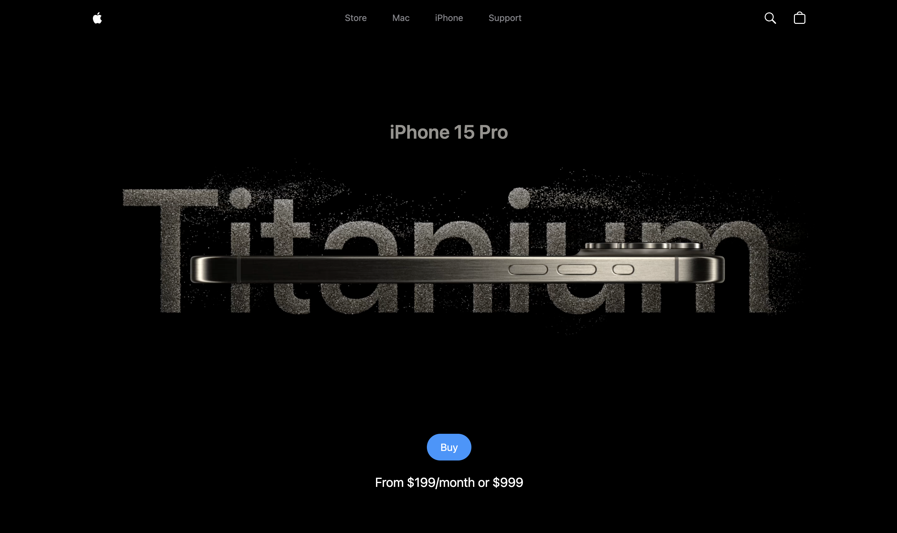
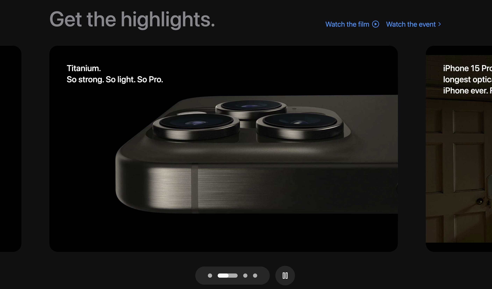

# iPhone 15 Website Clone 📱

   

---

A **pixel-perfect clone of Apple’s iPhone 15 Pro website**, built to practice **modern web development techniques** including React, Three.js, GSAP animations, and Tailwind CSS. This project helps understand how **interactive 3D websites** are structured and how animations can enhance user experience.  

This project was inspired by a YouTube tutorial from **JavaScript Mastery**, but extensively customized and enhanced to include additional functionality and responsiveness.

---

## 🚀 Tech Stack

| Frontend | Animations | Styling | Bundler |
|----------|------------|---------|---------|
| React.js | GSAP       | Tailwind CSS | Vite |
| Three.js |            |         |       |

---

## ✨ Features

- **Interactive 3D iPhone Model** using Three.js  
- **Smooth Animations** for scrolling and hover effects via GSAP  
- **Custom Video Carousel** for product demos  
- **Responsive Design** for all devices (mobile, tablet, desktop)  
- **Dynamic Model Variants** (colors and sizes)  
- **Clean Component Structure** for scalability and maintainability  

---

## 🛠️ Local Setup

### Prerequisites
Ensure you have the following installed:

- [Node.js](https://nodejs.org/en/)
- [npm](https://www.npmjs.com/)
- Git  

### Installation Steps
```bash
# Clone the repository
git clone https://github.com/<your-username>/iPhone15-clone.git

# Navigate to project folder
cd iPhone15-clone

# Install dependencies
npm install

# Start development server
npm run dev
